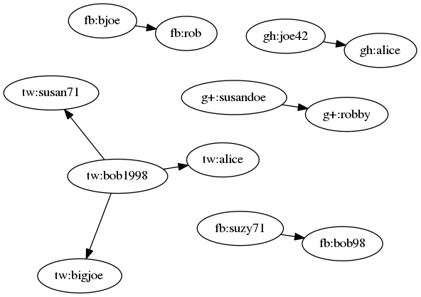
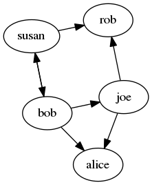

# Mixer

Simple prototype for creating derived graphs from social network data using
[Deriggy] and [Fluo].  This prototype goes with the
[talk](https://youtu.be/oqrjEexMLVE) given at the [Accumulo
Summit](http://accumulosummit.com/) in 2017.  This prototype has a shell that
supports the following commands :

```
$ ./mixer.sh shell fluo.properties 
>help
Commands : 

	follow <graph> <user id 1> <user id 2>
	unfollow <graph> <user id 1> <user id 2>
	alias <graph> <user id> <alias>
	unalias <graph> <user id>
	lookup <id>
	load <graph> <file>
	setattrs <graph> <id> {<key>=<value>}
	print
	help
	exit|quit
```

Changes to the derived graph are exported an Accumulo query table.  The lookup command accesses this query table, all other command interact with Fluo.

The following commands starts a MiniAccumulo and MiniFluo instance, which are required to run this example.  This creates a `fluo.properties` file containing connection information.

```bash
./mixer.sh mini &> mini.log &
```

After starting MiniFluo, the following starts a shell and adds some edges to multiple social network graphs.  For example assume `tw` represents Twitter, then in the Twitter graph `bob1998` follows `bigjoe`.

```bash
$ ./mixer.sh shell fluo.properties <<EOF
follow tw bob1998 bigjoe
follow fb bjoe rob
follow tw bob1998 alice
follow gh joe42 alice
follow tw bob1998 susan71
follow fb suzy71 bob98
follow g+ susandoe robby
follow fb suzy71 bob98
exit
EOF
```

The following commands visualize the derived graph in the external query table.


```bash
sudo apt install graphviz
```

```bash
./mixer.sh graphviz fluo.properties | neato -Tpng > sgraph1.png; xdg-open sgraph1.png
```



The following maps users in social graphs into the derived graph.  For example the Twitter user `bob1998` and the Facebook user `bob98` are  mapped to `bob` in the derived graph. 

```bash
$ ./mixer.sh shell fluo.properties <<EOF
alias tw bob1998 bob
alias tw bigjoe joe
alias fb bjoe joe
alias fb rob rob
alias tw alice alice
alias gh joe42 joe
alias gh alice alice
alias tw susan71 susan
alias fb suzy71 susan
alias fb bob98 bob
alias g+ susandoe susan
alias g+ robby rob
exit
EOF
```

After aliasing the users, the derived graph looks much different.

```bash
./mixer.sh graphviz fluo.properties | neato -Tpng > sgraph2.png; xdg-open sgraph2.png
```



The visualization does not currently show attributes. The following shows an example of how
attributes will automatically be mapped into the derived graph.

```bash
$ ./mixer.sh shell fluo.properties
>lookup joe
  joe <- bob        followers=1,following=3,rawEdges=1
  joe -> alice      followers=2,following=0,rawEdges=1
  joe -> rob        followers=2,following=0,rawEdges=1
>setattrs tw bob1998 loc=TX
>setattrs fb bob98 bday=8/13
>lookup joe
  joe <- bob        followers=1,following=3,loc=TX,bday=8/13,rawEdges=1
  joe -> alice      followers=2,following=0,rawEdges=1
  joe -> rob        followers=2,following=0,rawEdges=1
>lookup alice
  alice <- bob        followers=1,following=3,loc=TX,bday=8/13,rawEdges=1
  alice <- joe        followers=1,following=2,rawEdges=1
```

There are two interesting things happening here.  First, the attributes are mapped from the Twitter and Facebook users for bob into the derived graph.  Second, when this happens all of bob's neighbors in the derived graph are updated with the attribute information.  The same is
true for the folllwing counts, when these change for a node all of its neighbors are updated 
in the query table.

Removing `fluo.properties` causes MiniFluo to stop.

```bash
rm fluo.properties
```

[Deriggy]: https://github.com/keith-turner/deriggy
[Fluo]: https://fluo.apache.org
